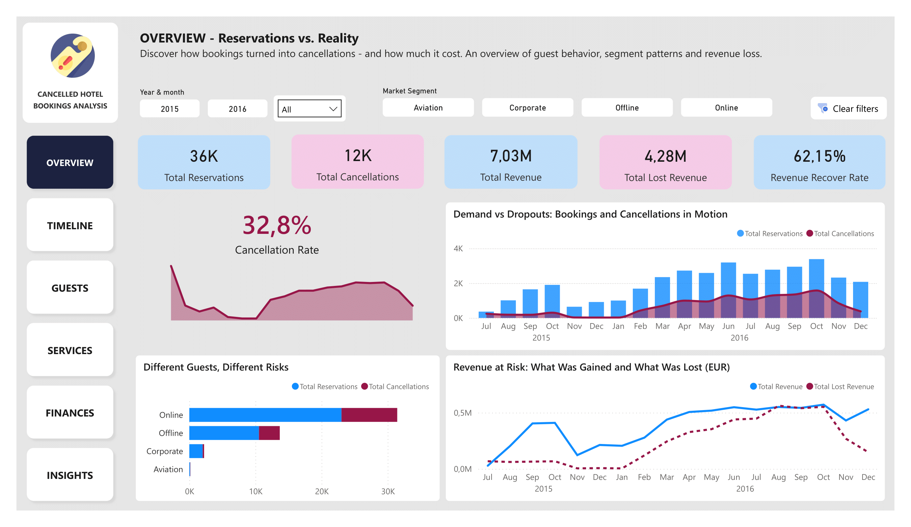
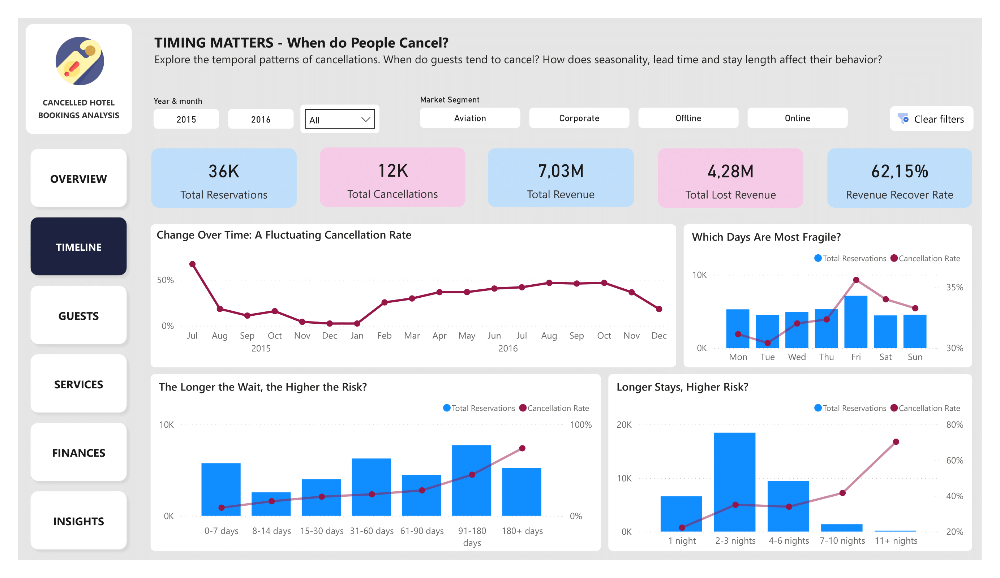
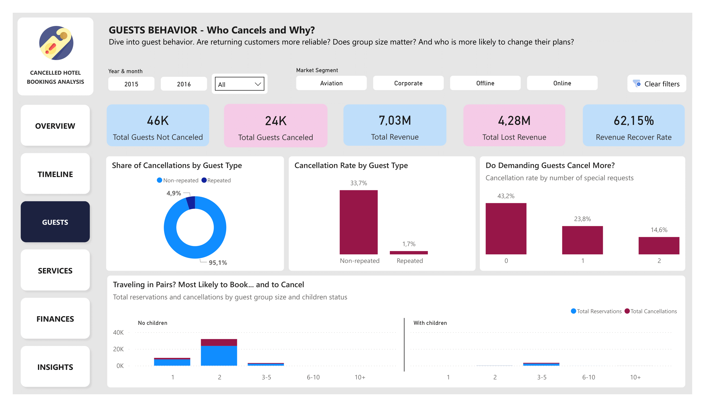
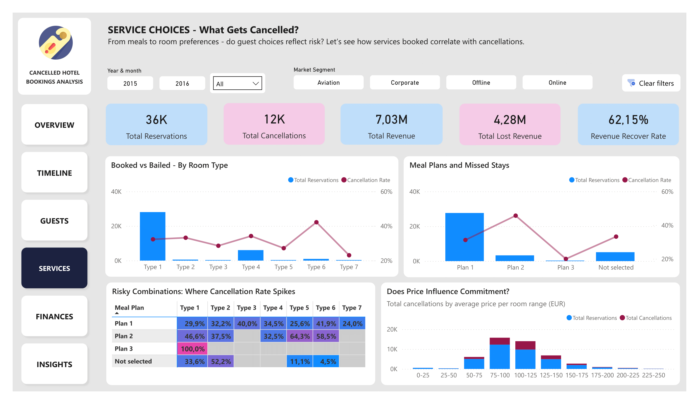
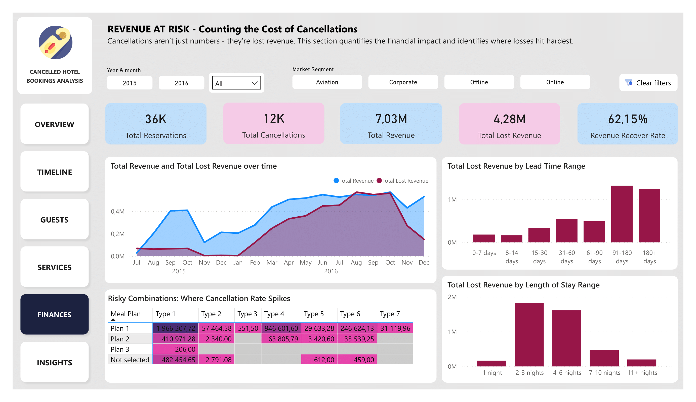
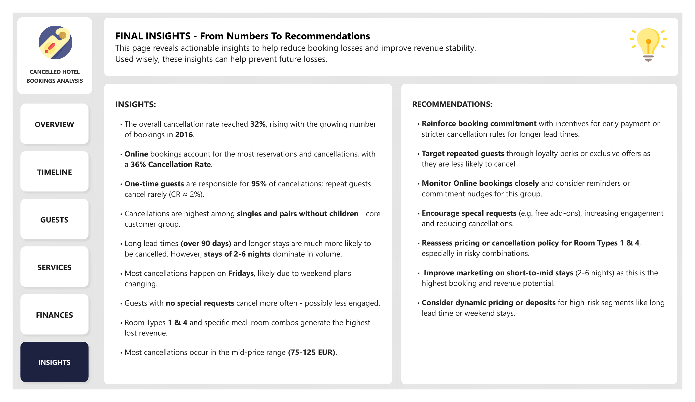

# Hotel Cancellations Trends Analysis

## Project Overview  
This project tackles a common business challenge in the hotel industry - booking cancellations, using a real-world dataset from Kaggle. 

I wanted to understand what drives these cancellations: who cancels, when, why and figure out how hotels can respond smartly. The result is a full data story built from scratch, designed to support hotel decision-makers with clear, actionable insights.

I went through the full process: data cleaning and preparation, initial exploratory analysis in SQL, and building a clean, interactive Power BI report.

## Data Preparation - cleaning and transformation (SQL)  

The data came as a raw CSV (around 36,000 rows), so I loaded it into SQL Server and created a cleaned version step-by-step.  
I adjusted formats and data types for proper analysis. I removed clearly incorrect or unusual records (like bookings with zero nights or no guests). I also standardized categorical values. Surprisingly, the dataset had no NULL values, which made things easier. As a final step I created a cleaned version (`reservations_cleaned` table) with adjusted data types and consistency fixes as well as with only valid rows for further analysis.

This phase was also a chance to practice clean, well-structured SQL and to lay a strong foundation for the Power BI layer.

## Exploratory Data Analysis (SQL)  
The EDA process was structured into logical steps, mimicking a real-life analytics workflow. Valuable insights already began to emerge here - seasonal booking patterns, segments more prone to cancellations, and pricing dynamics.

Each step focused on a different theme:

- **Time trends & seasonality** - booking and arrival patterns over time  
- **Customer segmentation** - market segments: who books what and when, room types, meal plans  
- **Guest behavior** - average length of stay, special requests, returning guest share  
- **Revenue & pricing** - price levels by room type, season, and segment  
- **Operational metrics** - parking demand, guest group sizes, presence of children  
- **Lead time patterns** - lead time bins linked to cancellation likelihood  
- **Cancellation risks** - cancellation rates by time, guest profile, pricing  
- **Feature engineering** - helper columns and bins to support visual storytelling  

## Power BI Dashboard - Pages & Themes  
The final report includes six themed pages, each exploring booking and cancellation dynamics from a different perspective:

1. **Overview** - big picture of trends, bookings & cancellations and revenue status  
2. **Timeline** - time-based dynamics (seasons, weekdays, booking spikes) 
3. **Guests** - who cancels the most (and who doesn’t) 
4. **Services** - guest preferences and their link to cancellations (rooms, meals, extras)  
5. **Finances** - revenue losses, price sensitivity, risk segments
6. **Insights** - key takeaways and concrete ideas to reduce cancellations

While creating each page, I practiced structuring the dashboard as a data story - to make insights easier to follow and act on.

👉 ## View the live dashboard: [link here]

Here is preview of each page:

| Page 1 | Page 2 |
|--------|--------|
|  |  |

| Page 3 | Page 4 |
|--------|--------|
|  |  |

| Page 5 | Page 6 |
|--------|--------|
|  |  |

## Tools & Skills Used  
- **SQL Server** - data cleaning and exploratory analysis  
- **Power BI Desktop** - interactive report design, visual storytelling  

## Repository Structure
- `data/` - folder containing raw dataset:
  - `raw_data.csv` - source data file
- `sql/` - folder containing SQL scripts:
  - `data_cleaning.sql` - SQL script for data cleaning
  - `exploratory_data_analysis.sql` - SQL queries for exploratory data analysis
- `powerbi/` - folder with Power BI file:
  - `report.pbix` - fully interactive report file
  - `preview/` - image preview of each report page
- `README.md` - project documentation

